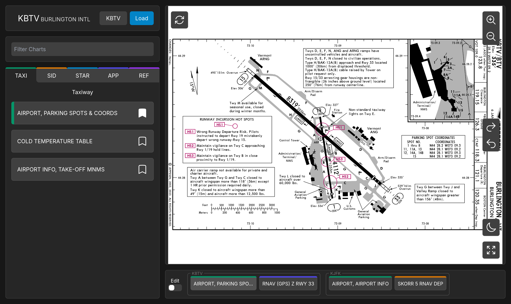

# Flight Planner


## Setup and Running
To setup run the following command in both the client and server directories:
```
npm install
```
To run, run the following command in both the client and server directories:
```
npm run start
```
then navigate to the localhost address provided by vite in a browser.
